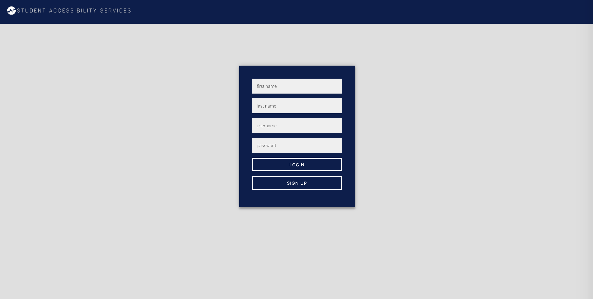

# Student Accessibility Portal (SAP)

## Iteration 02 - Review & Retrospect

 * When: Thursday March 8th, 2018
 * Where: Tutorial room (LM155)

## Process - Reflection

For this iteration we were able to complete all tasks assigned in the planning meeting and successfully created the front end of our product. Through this process we found that meeting ofen and assigning specific roles for each member was important for keeping organized. Additionally, documenting our meetings was a key element for the success of this iteration, we were able to stick to our goals and kept us responsible for any deadlines and tasks.

#### Decisions that turned out well

List process-related (i.e. team organization) decisions that, in retrospect, turned out to be successful.

*	Using pairs to divide up the work and video
  * This way each person has someone to provide support when needed
  * This keeps each member from getting too overwhelmed with the tasks and we are overall more productive if we split up the work into sub-tasks
  * Working as a pair also keeps each other accountable for the tasks assigned
* Documenting the meetings
  * Allowed everyone to see all tasks and the status of tasks all in one place throughout the iteration
  * Enabled project transparency for everyone in our team
  * Kept our goals organized and enabled us to visualize what needs to be done
  * allowed us to set effective deadlines
*	Having two meetings per week
  * Allowed us to stay on task and to communicate often and effectively
  * Helped those who needed it and kept us up to date on the the status of the program
  * Allowed us to stay organized and set achievable milestones

#### Decisions that did not turn out as well as we hoped

List process-related (i.e. team organization) decisions that, in retrospect, were not as successful as you thought they would be.

- Using React
  * It was too bloated for the purposes of our project
  * Not everyone was comfortable with using it, as we have different skill levels
  * Solution: discard React and use a MEAN stack instead
- In the first week we decided to not have other roles such as project manager etc.
  * We realized it was hard to stay organized especially in a team as large as 6 people and it was difficult to determine which tasks we needed to prioritize
  * In the middle of this iteration we added more roles for each team member (as seen in plan.md)
- Having a sign-in page
  * Since we are using utor ids we realized we do not need users to sign up with a username or password
  * We will replace it will a “register for accessibility services” page, this makes more sense for our product since UofT requires you to first register before accessing the various services

#### Planned changes

List any process-related changes you are planning to make (if there are any)

- Increase the number of in-person meetings when preparing backend of the project
  * In-person meetings provide more efficient communications and code integration compared to online discussion and meetings, which is required for backend code writing and testing
- Increase number of code-review meetings
  * This is so we are following the same conventions and ensures that our code is clean and readable
  * We realized that we need to understand each others code better in order to integrate each of our parts, code-review would allow us to sync our code

## Product - Review

#### Goals and/or tasks that were met/completed:

The most important goals and tasks that we completed are listed below

- [x]	Fill out plan.md on February 8th
- [x]	Plan the front end and assign tasks to each pair
  *	This includes the style guideline. We used the UofT guideline found here (https://www.utm.utoronto.ca/sites/files/default/public/shared/advancement/pdfs/UofT%20Style%20Guide%20%2B%20Boundless%20Guide%20Feb%202012.pdf) but the important ones were:
  *	Colors - https://drive.google.com/open?id=1DY4e3-LNuZeTWMEUKEQGycu2U6pTqk3v
  *	Fonts - https://drive.google.com/file/d/1nUZQJ9bw-GvwdBwPPW8hnpiPk8g0tneG/view?usp=sharing
- [x]	Determine github workflow: like the assignment where we fork and then merge together
- [x] Determine structure of files (MVC)
- [x]	Finish all polished front end pages by Tuesday, March 6
- [x]	Finish and send Nav Bar and headers for everybody’s page (Nicole and Nadine) by Monday, March 5
- [x]	Create a voice over script for video by Tuesday, March 6 (Everyone)
  *	This can be found here: https://drive.google.com/open?id=1eU9rJGJMMUXNXhAHGsbX2b8Flt8HskYA9S3hHDQvUa0
- [x]	Film a video of the workflow of our prototype on Wednesday, March 7
  *	Video of our demo can be found in the following link: https://www.dropbox.com/s/ttyakwldhcmriup/CSC301%20Group%20121%20Deliverable%202.mov?dl=0
- [x]	Link all of the nodes and pages properly on Tuesday, March 6
- [x]	Film the introduction skit for the video on Thursday, March 8
- [x]	Fill out plan and iteration.md on Thursday, March 8
- [x]	Combine and put together our deliverable submission Thursday, March 8
- [x]	Commit and merge on Github on Friday, March 9

Meeting documents of our in person Thursday meetings that list and state meeting notes, status of tasks, and goals/to-do list:
*	Meeting 1: https://docs.google.com/document/d/1FRq19zE9ZXFys5GLGv8vO_RzwEBVPfhBcXIewvWb4YA/edit?usp=sharing
*	Meeting 2: https://docs.google.com/document/d/19QmhAOZ_novHj6MAWsPnwBtWGCvQgd_wI0T1OXw_m1M/edit?usp=sharing
*	Meeting 3: https://docs.google.com/document/d/1G9IPb6qS-P0EDXpOZsz-2JZXWyn5LrNNW91-NpWn34s/edit?usp=sharing

Screen-caps are provided below of our Sign Up/Register page which was not captured in our demo video:

#### Goals and/or tasks that were planned but not met/completed:

- Create search function for our web pages
  *	This is planned to be finished in iteration 3
  *	This feature is a bonus feature that is not imperative for the operation of the website, users are still able to understand how the website works and we are able to create a demo without this feature which is why we are giving it a low priority
- Filtering categories in the all services page
  *	Will be fixed by the next iteration
  *	We ran into a few issues with the API we are using to render our graphs. Since the graphical interface is the most important element of our product, we spent our time fixing this issue. Additionally, this feature relies on the graph interface to work.

## Meeting Highlights

Going into the next iteration, our main insights are:

- Continue to meet often and stick to assigned roles
  *	For this iteration we found that having frequent meetings work for us so we want to continue to do this for the next iteration
  *	Having a project manager, product owner, research and data collectors, and technical expert was integral to this iterations success so we want to ensure that we are sticking to these roles as we move into the next iteration
- Work on the back-end (e.g. how to keep each student’s information) and integrate it with the front-end
  *	We have to spend some time thinking about the structure of our database because for this iteration most pages are static files with some hard coded data
- Do more research on accessibility services and implement more services
  *	We realized as we are working on the front end that we are missing important data that would populate our graphs
  *	Through this research we will also figure out the best way to structure our graphs (ie. which services should be the parent nodes, which services should be sub-services or the leaf nodes)
